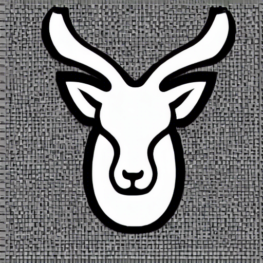

<!-- python scripts/txt2img.py --prompt "tibetan antelope head logo, simple, black and white, transparent background" --plms -->

--------

黑洞的合并过程是引力波源之一，本项目使用[Taichi Lang](https://github.com/taichi-dev/taichi)数值模拟双黑洞的合并过程。

Frans Pretorius于2005年首次提出双黑洞的激发、合并与振铃的数值模拟。下图展示了此模拟的过程。两个黑洞相互围绕旋转，黑洞视界越来越来扭曲。在某个时刻，事件视界合并形成一个扭曲的黑洞。这个黑洞会进行阻尼准正态振铃，最终稳定下来成为克尔黑洞。

